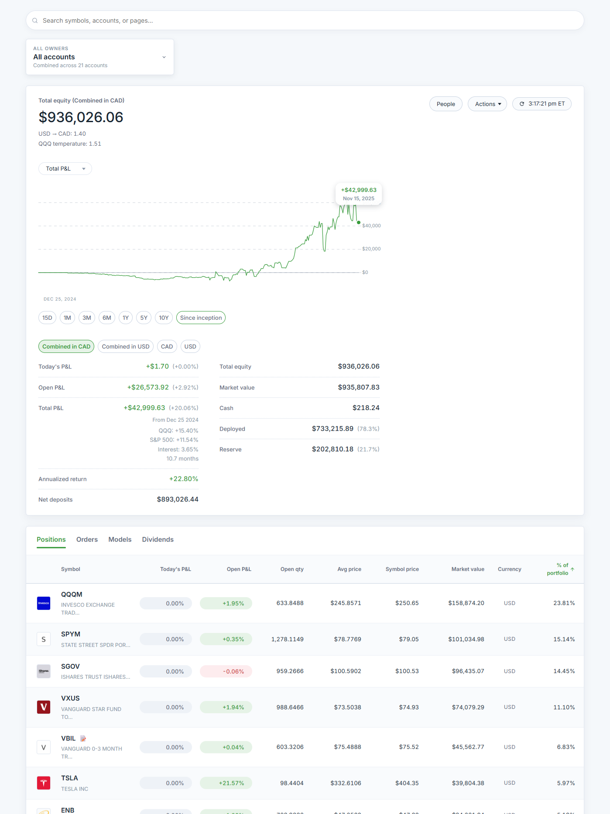
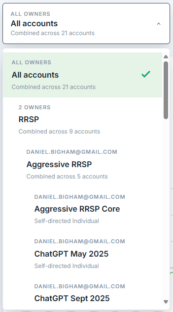
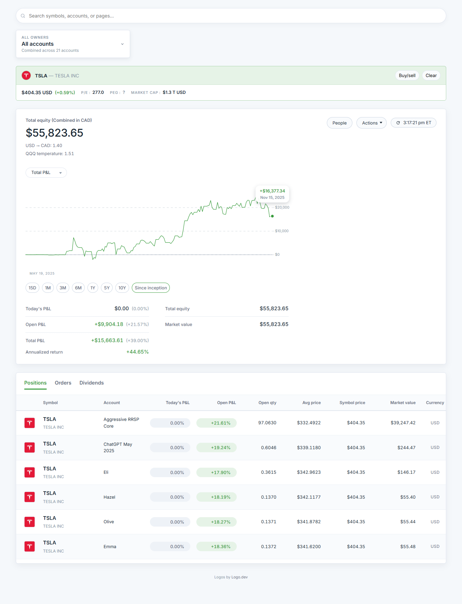
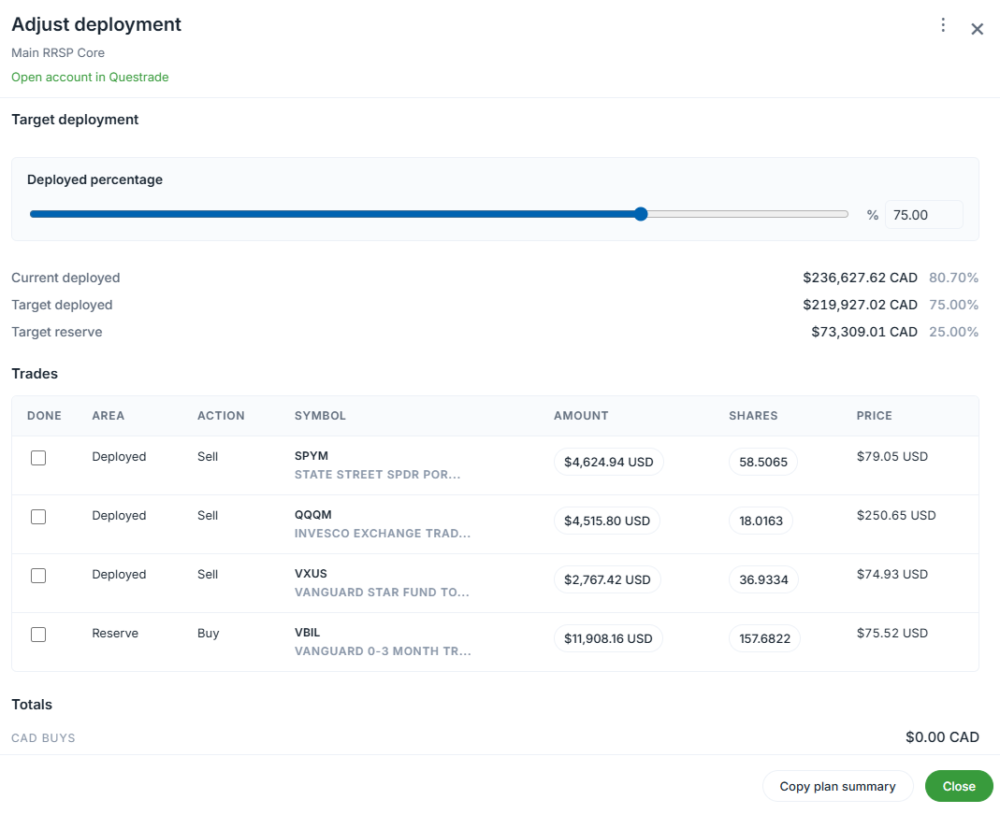
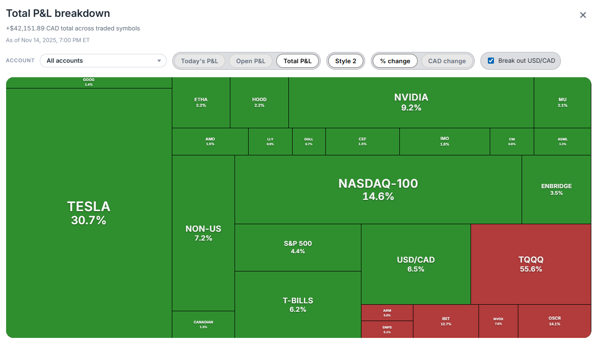
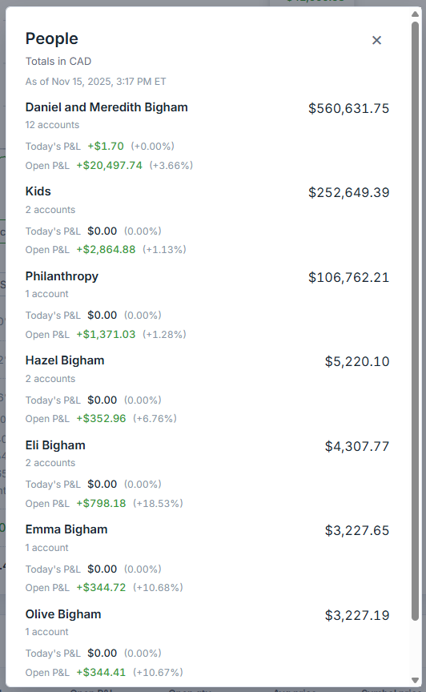
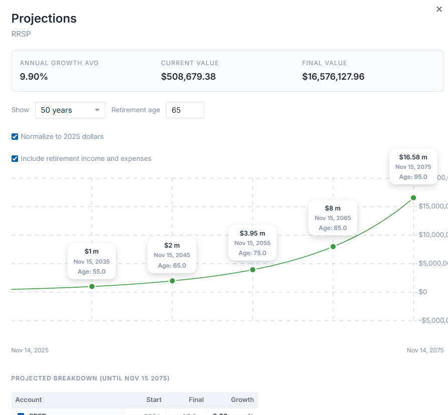
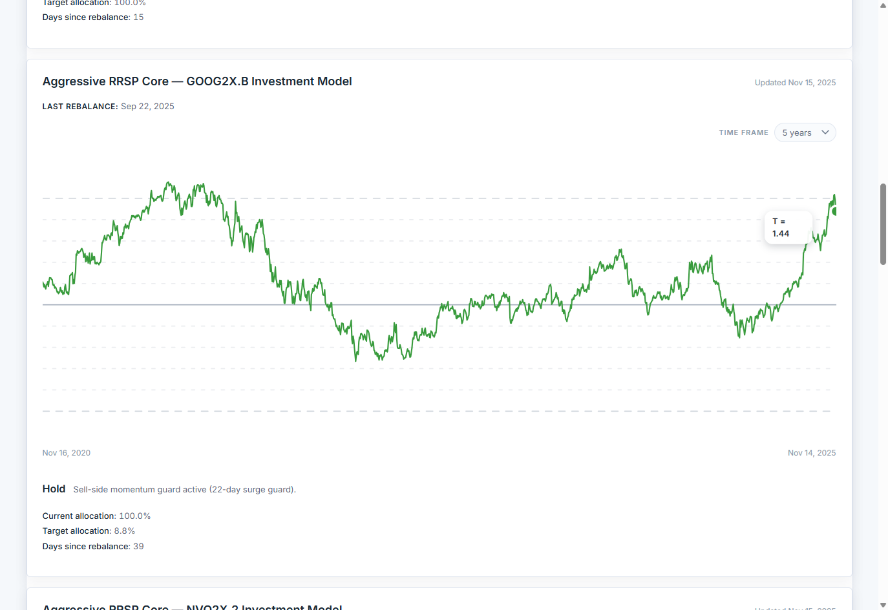
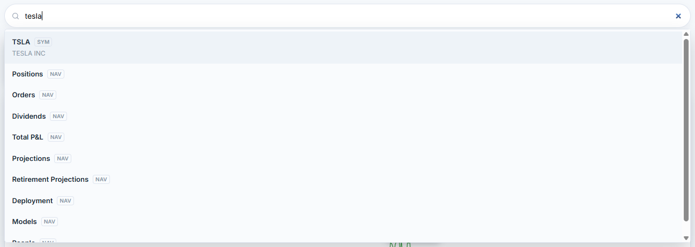

# Questrade Summary View

A household-first dashboard that mirrors the Questrade "Summary" page, but lets you line up every login, compare CAD vs USD exposure, surface contributions, run dividend and projection reports, and share the view with your partner. Everything runs locally and only reads live data through Questrade's public API.



## Highlights

- Household-aware account selector with saved nicknames, default landing accounts, and deep links back into the Questrade portal.
- Rich equity card that rolls up cash, buying power, day/open P&L, funding progress, CAGR, and household adjustments.
- Positions table with instant filtering, logo support, and a context menu for copying trade prompts or drilling into symbol-level analysis.
- Dedicated tabs for Dividends, Deployments, Projections, News (OpenAI-powered), and CAD/USD cash breakdowns.
- "People" overlay that converts everything to CAD, totals per person, and keeps multiple households in sync.
- Optional investment-model bridge to evaluate TQQQ-style strategies or QQQ "temperature" overlays next to your actual holdings.
- Built as a Vite + React SPA backed by a tiny Express proxy that handles OAuth refresh cycles for every configured login.

## Guided tour

### All accounts, always in sync


Keep multiple logins and sub-accounts pinned wherever you want them. Ctrl/?-click opens the native Questrade portal, and you can favourite any account as the default landing zone after a restart.

### Drill into any symbol without leaving the view


Hover or search for a ticker to break down open quantity, currency exposure, dividend history, and account-level ownership. The per-row menu also drafts prompts or "invest cash evenly" plans based on live positions.

### Understand deployment and cash plans


Track how much of your cash pile is deployed over time, target reserve levels, and apply overrides by login. Switch between absolute CAD and percent deployed, then generate an action plan directly from the data.

### Funding, dividends, and total P&L stories


Every badge on the equity card opens a focused dialog: funding history, dividends grouped by symbol and date range, or a P&L breakdown that highlights where gains and drawdowns originated.

### Household perspective with one click


Translate every holding to CAD and view balances per person (or entity) across logins. Useful for joint planning sessions or making sure RESP/TFSA goals stay on target.

### Plan the future as well as the present


Toggle into the projections tab to test growth rates, contribution schedules, or investment-model overlays. Multiple presets (see also `docs/screenshots/projections-view-2.png`) show alternative timelines without leaving the dashboard.

### Investment models and automation hooks


When the optional Python helper is installed, the app keeps your reference model (for example TQQQ + reserves) beside live accounts, showing temperature, drift, and the trades required to snap back to target.

### Search once, act anywhere


The omnibox jumps to accounts, tickers, tabs, or dialogs. Need to open the Dividends tab for a symbol or edit account metadata? Type a few letters and hit enter. Shortcuts keep the workflow fast.

## Under the hood

- `client/` - React + Vite SPA with TanStack Query for data orchestration, accessible dialogs (Radix primitives), and CSS tuned for dense financial layouts.
- `server/` - Lightweight Express proxy that refreshes OAuth tokens per login, caches the newest refresh token, enriches account metadata, and exposes everything through `/api/summary`.
- `shared/` - Date math, deployment helpers, and formatting utilities reused by both sides.

## Run it yourself

You only need Node.js 20.19+, Git, and at least one Questrade API refresh token. Python 3.9+ is optional unless you want investment-model overlays.

```bash
# one-time
cd server && npm install
cd ../client && npm install

# start the stack (two terminals)
cd server && npm run dev
cd client && npm run dev
```

From there browse to `http://localhost:5173`, drop in your refresh tokens, and the dashboard lights up. The proxy will persist replacement tokens so you can keep the terminals running indefinitely.

Need the full playbook (environment variables, metadata files, optional helpers, production builds, etc.)? See the [setup & running guide](docs/setup-and-running.md) for step-by-step instructions.

## Credits

- Company logos powered by [Logo.dev](https://logo.dev).
- Screenshots captured via the internal [UI screenshot guide](docs/ui-screenshot-guide.md).
