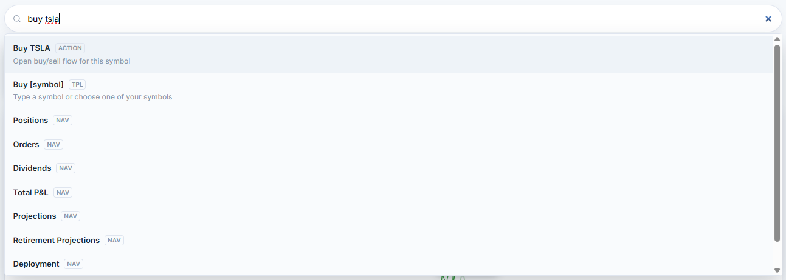
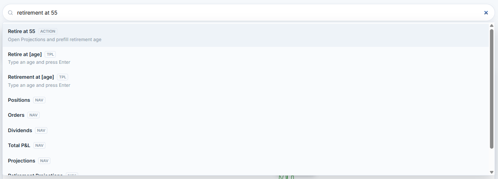
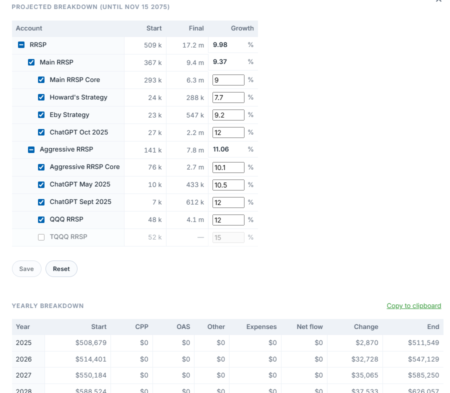

# Investments View (Questrade Viewer)

A dashboard similar to the Questrade "Summary" page, but lets you aggregate multiple Questrade logins.

Other key features:

- Organize your accounts into a hierarchy of account groups, and see stats for them. (e.g. RRSP)
- Total P&L graph
- Total P&L breakdown by ticker in a graphical view (Also for today's P&L and open P&L)
- Annualized return (XIRR)
- Retirement projections, including CPP + OAS calculations
- Deployed vs. reserve (Cash + T-bill ETFs) with a tool for adjusting this percentage
- Everything runs locally reads data through Questrade's public API.


## Guided tour

### Account selector


Organize your accounts into a hierarchy of account groups.

Ctrl-click to go to the account on questrade.com.

### Drill into any symbol


See total P&L and other stats for any symbol, as well as orders and dividends.

### Total P&L breakdown


See which symbols (or currency changes) contributed to your total P&L.

### Search bar




The omnibox jumps to accounts, tickers, tabs, or dialogs. Need to open the Dividends tab for a symbol or edit account metadata? Type a few letters and hit enter. Shortcuts keep the workflow fast.

### People view


Aggregate various accounts by person.

### Retirement projections




Define which account (or account group) represents your retirement savings, define projected growth rates for your accounts, then see projections.

A questionare can be filled in to allow CPP and OAS calculations. ([edit-account-details-dialog-1.png](docs/screenshots/edit-account-details-dialog-1.png), [edit-account-details-dialog-2.png](docs/screenshots/edit-account-details-dialog-2.png))

### Adjust deployment vs. reserve amounts


When adjusting the percentage of capital deployed, computes buys/sells and makes it easy to copy and paste values when making trades.

### Investment models and automation hooks


When the optional Python helper is installed, allows you to associate automated investment models with stocks in your accounts.
When the main view is loaded, you'll be warned when it's time to rebalance according to the investment model's rules.

## Under the hood

- `client/` - React + Vite SPA with TanStack Query for data orchestration, accessible dialogs (Radix primitives), and CSS tuned for dense financial layouts.
- `server/` - Lightweight Express proxy that refreshes OAuth tokens per login, caches the newest refresh token, enriches account metadata, and exposes everything through `/api/summary`.
- `shared/` - Date math, deployment helpers, and formatting utilities reused by both sides.

## Run it yourself

You only need Node.js 20.19+, Git, and at least one Questrade API refresh token. Python 3.9+ is optional unless you want investment-model overlays.

```bash
# one-time
cd server && npm install
cd ../client && npm install

# start the stack (two terminals)
cd server && npm run dev
cd client && npm run dev
```

From there browse to `http://localhost:5173`, drop in your refresh tokens, and the dashboard lights up. The proxy will persist replacement tokens so you can keep the terminals running indefinitely.

Need the full playbook (environment variables, metadata files, optional helpers, production builds, etc.)? See the [setup & running guide](docs/setup-and-running.md) for step-by-step instructions.

## Credits

- Company logos powered by [Logo.dev](https://logo.dev).
- Implemented using [ChatGPT Codex](https://chatgpt.com/codex).
